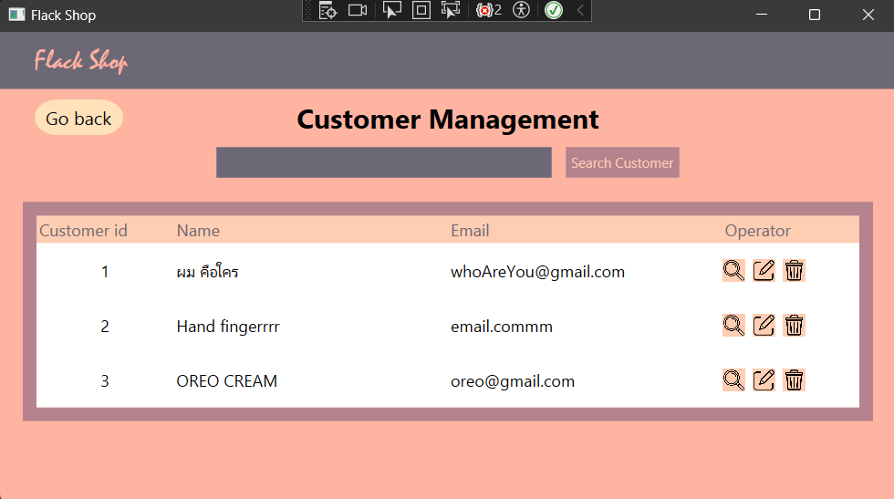

# bookStore_2
 เป็นโปรเจคการพัฒนาต่อยอดความรู้จากที่ได้ศึกษาและเพิ่มทักษะในความเข้าใช้การทำงานของ OOP concept programing 

## ความเป็นมาของการทำ Project 
1. จากโจทย์ที่ได้รับคือจะต้องมี การจัดการหลักๆทั้งหมด 3 ส่วนคือ
`ข้อมูลหนังสือ` `ข้อมูลลูกค้า` `ข้อมูลการขายสินค้า` โดย ข้อมูลหนังสือและข้อมูลลูกค้าจะต้องสามารถ `เพิ่ม` `ลบ` `ค้นหา` และ `แก้ไข` ได้ 

> [!NOTE]
> แต่ในส่วนของ `ข้อมูลการขาย` ไม่ได้บอกข้อกำหนดเอาไว้ ดังนั้นผมจึงกำหนดเองว่าจะต้องมีการ `เพิ่ม` `ลบ` และ `ค้นหา` แต่จะไม่สามารถแก้ไขได้เพราะเป็นข้อมูลที่มีความสำคัญ ซึ่งเกิดจากการขาย

2. การออกแบบ UX/UI เริ่มต้นด้วยการออกแบบ โดยวางรูปแบบในธีมที่สะอาดและสบายตาในการมองของผู้ใช้งานและการเลือกใช้สีใช้ในธีมย้อนสมัยด้วยสีเหล่านี้ 
`#FFCDB2` `#FFB4A2` `#E5989B` `#B5838D` `#6D6875`

3. การออกแบบลำดับการทำงานจากโจทย์ที่ได้รับมา จะต้องมีดังนี้

    
    
> [!NOTE]
> ในการออกแบบเพื่อให้ง่ายต่อการใช้งาน จำเป็นจะต้องออกแบบให้ผู้ใช้งานอ่านน้อยที่สุดและใช้ปุ่มสำหรับการเข้าถึงข้อมูล

4. การออกแบบฐานข้อมูล จากโจทย์ได้กำหนดคร่าวๆทั้งหมด 3 ตารางดังนี้

    - Customers:

        | Columns | Data type |
        | ---- | ---- |
        | Customer_ID | `INTEGER PRIMARY KEY` |
        | Customer_Name | `varchar(50)` |
        | Address | `varchar(50)` |
        | Email | `varchar(50)` |

    - Books:

        | Columns | Data type |
        | ---- | ---- |
        | ISBN | `INTEGER PRIMARY KEY` |
        | Title | `varchar(150)` |
        | Description | `varchar(150)` |
        | Price | `DOUBLE` |

    - Sales:

        | Columns | Data type |
        | ---- | ---- |
        | Sale_ID | `INTEGER PRIMARY KEY AUTOINCREMENT` |
        | ISBN | `INTEGER` |
        | Customer_ID | `INTEGER` |
        | Quantity | `INTEGER` |
        | Total_Price | `DOUBLE` |

>[!NOTE]
>ตารางข้อมูลการขายให้ ID เป็น `AUTOINCREMENT` เพราะว่าเป็นข้อมูลการขายไม่จำเป็นจะต้องกรอก ID ที่เจาะจงเหมือนกับ `ข้อมูลลูกค้า` และ `ข้อมูลหนังสือ`

## วิธีการใช้งาน Program

1. เมื่อเปิดโปรแกรมขึ้นมาครั้งแรกจะขึ้นหน้าสำหรับเข้าสู่ระบบโดยเราจำเป็นจะต้องกรอกข้อมูล Email และ Password ให้ครบ

<!-- รูป -->

> [!NOTE]
> การ Login เป็นการ Mockup สำหรับจำลองการเข้าสู่ระบบแต่ยังมีการคัดกรองที่ผู้ใช้จำเป็นต้องกรอกข้อมูลถึงจะผ่านหน้านี้ไปได้

2. จากนั้นจะเข้าสู่หน้าเมนูหลักสำหรับไปยังหน้าต่างๆ

<!-- รูป -->

3. หน้า `จัดการข้อมูลลูกค้า` และ `จัดการข้อมูลหนังสือ` การทำงานที่คล้ายกัน โดยเมื่อกดเข้ามาแล้วจะมีให้เลือกทั้งหมด 2 ปุ่มคือ `Create` and `List`

<!-- image -->

เมื่อกดเข้า `Create` จะแสดง Form สำหรับสามารถสร้างข้อมูลได้

<!-- รูป -->

เมื่อกดเข้า `List` จะแสดงข้อมูลทั้งหมด โดยปุ่มทั้ง 3 กดแล้วจะสามารถ `ดูรายละเอียด` `แก้ไขข้อมูล` และ `ลบข้อมูล` ได้ตามลำดับ

<!-- รูป -->

4. หน้า `การจัดการสั่งซื้อ` จะมีลักษณะดังนี้

<!-- รูป -->

โดยจะต้องกรอกข้อมูลให้ครบทั้งหมดแล้ว `ข้อมูลหนังสือ` และ `ข้อมูลลูกค้า` จะแสดงขึ้นมา

<!-- รูป -->

จากนั้นเราจะสามารถยืนยันเพื่อสร้างการสั่งซื้อได้

<!-- รูป -->

5. หน้า `ประวัติการสั่งซื้อ` จะมีลักษณะคล้ายกับ `List` ของการจัดการข้อมูล `หนังสือ` และ `ข้อมูลลูกค้า` แต่จะเอาการแก้ไขออกไป

<!-- รูป -->

6. ในการค้นหาข้อมูล `List` จะสามารถค้นหาได้เพียงแค่ ID เท่านั้น

<!-- รูป -->

## สรุปผลที่ได้

1. ได้ทบทวนความรู้ที่ได้เรียนไป
2. ได้ทดลองและพัฒนาต่อยอดจาก Project ก่อนหน้า [BookStoreApp](https://github.com/Phiraphat0123/BookStoreApp)